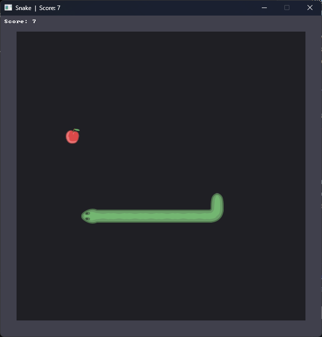
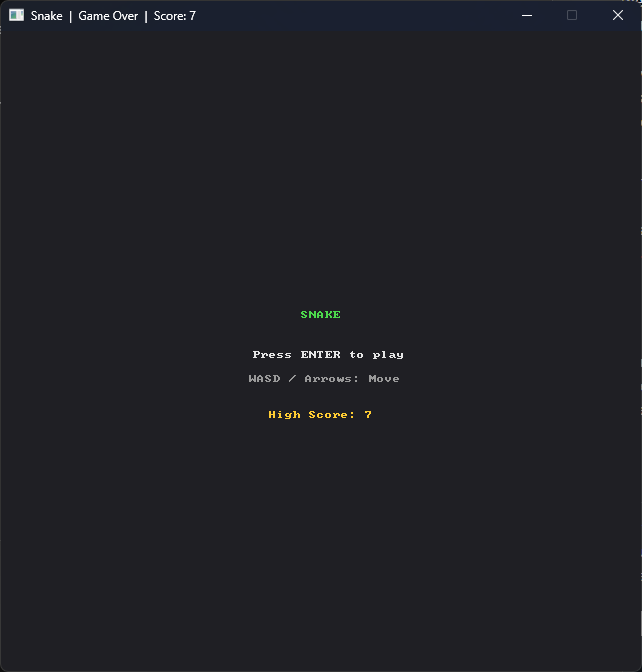
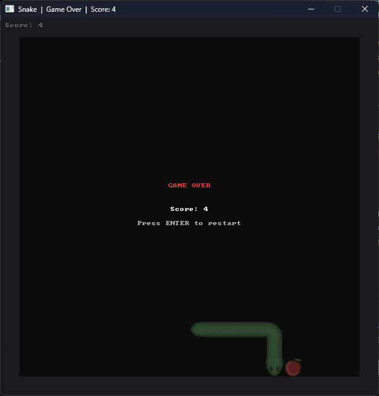

# Sneq

I asked an AI (Claude Opus 4.6) to write a simple snake clone based on a skeleton I gave it and my very own SDL3 bindings for C#: [SDL3#](https://github.com/Sdl3Sharp/). This repository contains the results of that experiment, as well as the setup I provided.

## Prequisites

I used this as an experiment to test my [SDL3#](https://github.com/Sdl3Sharp/) bindings. Because they're new, they AI couldn't have any prior knowledge of them. So it needed to try to learn how to use them in an instant. This would show my how intuitive my API design actually is and if I'm on the right track with it. If an AI can learn how to use my bindings, so can everyone else, I'm sure of it.

## Setup

I provided what I will call a "pre-prompt": A prompt to another AI (Claude Sonnet 4.6) to write me a bigger and better prompt that I can then feed to the AI that will write the actual code. That should help ensure that the AI is able to generate the best possible outcome in a **single prompt*.\
In the pre-prompt, I also told the AI to pass on certain sources where it can find API informations an documentation about my bindings:

- The XML documentation file that I generated alongside my bindings: [Sdl3Sharp.xml](skeleton/Sdl3Sharp.xml)
- The source code of my bindings themselves on GitHub: <https://github.com/Sdl3Sharp/Sdl3Sharp>
- A very crude online documentation I made for my bindings: <https://sdl3sharp.github.io/Sdl3Sharp/api/Sdl3Sharp.html>

You can find the pre-prompt here: [original-prompt.md](original-prompt.md).

Also also provided skeleton code for the AI to work off. I even managed to accidentally put a bug in, in that I forgot to run the app main loop by calling `sdl.Run(...)`.\
The main source is [sneq.cs](skeleton/sneq.cs) as I asked the AI to write a single file-based top-level C# app.\
There are more files to the skeleton, a [sprite atlas](skeleton/snake.png) and a [MSBuild file](skeleton/Directory.Build.props) that helps me embedding the sprite atlas into the final executable.

Here's where you can find the skeleton: [skeleton](skeleton/).

Also the sprite atlas I used is from this tutorial on building a snake game in HTML5: <https://rembound.com/articles/creating-a-snake-game-tutorial-with-html5>.

There's one last important thing to note about the setup. In the directory containing the skeleton, I also included the XML file containing the API documentation for my [SDL3#](https://github.com/Sdl3Sharp/) bindings. The AI generating the code was then pointed to that file.

## Results

Firstly, the results of giving the pre-prompt to the first AI (Claude Sonnet 4.6): [generated-prompt.md](generated-prompt.md).

That was actually quite insightful. Not only did the AI generate the prompt I asked for in Markdown, it seems like it tried to learn from the given documentation sources itself, and then tried to help the other AI by giving it more detailed pointers. That's despite the fact that I just asked it to pass them on. Honestly, that was quite unexpected and impressive to see. The acutal prompt seems pretty good to me, and I feel like the AI tried to fill out the blanks in my initially very vague prompt.

Now, the results of the second AI (Claude Opus 4.6) generating the actual code. I then gave the second AI the generated prompt and let it do its thing. It took right around 16 minutes to finish and what it did is actually quite impressive to me. Not only did it manage to fix the aforementioned bug in my skeleton code, it actually learned how to use my binding API correctly and implemented a almost flawlessly working clone of Snake, that's way more complete that I would ever expected it to be. And all of that on the very first try.

To be honest, there are two issue that are noteworthy with this first result. For one, the snake tail was flipped, but that could be easily been my fault by incorrectly explaining the orientation within the sprite atlas it in my pre-prompt. And for the second issue, the game did go back to a new game right away after a game over screen, which works, but I feel like isn't ideal. So I asked the AI (still Claude Opus 4.6) to fix those issues as my second prompt.

And it did. Not only that, but because now the game takes the player back to the title screen after a game over, the AI also implemented a high score that's shown on the title screen, which is a nice touch and I didn't even asked for it.

## Conclusion

So overall, I'm very impressed with the results of this experiment. 

If you like to check out the final code, you can find it here: [src](src/). If you want to run it for yourself, you can do so by changing into the `src` directory and running

```shell
dotnet run sneq.cs
```

Since it's using the platform-independent version of [SDL3#](https://github.com/Sdl3Sharp/), and should run on Windows and Linux, as long as you have a .NET10+ SDK or .NET10+ Runtime + dotnet CLI installed.

If you have issue starting the game, try run

```shell
dotnet clean sneq.cs
```

followed by

```shell
dotnet restore sneq.cs
```

Sometime you have to do that twice for it to work.

Finally, here are some screenshots of the final game:




